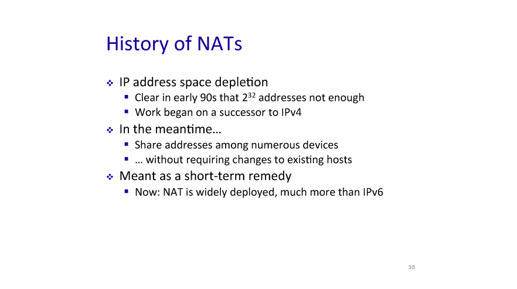

같은 네트워크 내의 사용자들은 각자 고유의 IP 주소 배정

실제 IP 주소는 내부에서만 유일, 외부적으로는 유일하지 않음

IP 주소 외부로 나가면 가긴 가는데 구글에서 돌아 오려할 때 문제가 생김

유일한 주소가 아님

이 문제를 해결하기 위해 gateway ip 주소로 바꿔줌

구글이 이 패킷을 받아 보내면 NAT 다시 변환 함

---

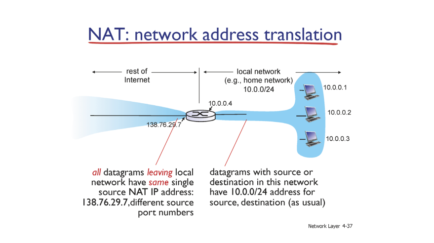

IT 주소는 interface 개수만큼 있음

gateway router는 interface가 구분되고 각자 ip 주소를 갖되

router는 10.0.0의 동일한 prefix 가져야함

왼쪽 subnet은 다른 주소 가짐

오른쪽 subnet에서 나갈 때 router의 ip 주소로 바꿔줌

데스티네이션이 구글이면 packet은 router로 다시 return

router로 오면 다시 변환해서 subnet으로

=> 주소공간 문제 해결

문제점

1. 디자인 상의 문제점

   layer 디자인이 무너짐

   router가 ip 주소 고쳐버림 나갈때도 고침

   

destination ip address로 호스트 number를 찾아야 하는데

ip 주소로 host를 찾을 수 없음

port 번호 변환해서 host를 찾아야함

layer에서 뒤죽박죽 됨

80번으로 들어와도 변환됨

사실은 NAT IPv4를 들고 있을 수 있게 하는 트릭이긴 하지만 깨끗한 방식은 아님

그래서 어떤 방식으로도 고치긴 고쳐야 함

---

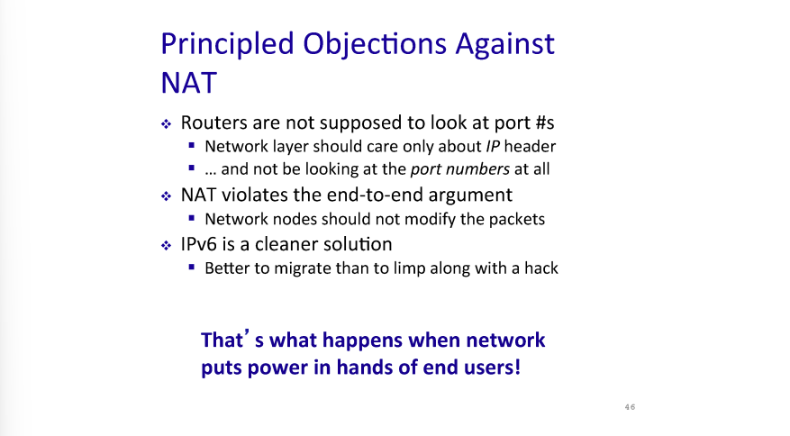

---

IPv4 70년대 만들어져서 반세기 쓰고 있는데

security 문제

주소 공간 부족

=> 새로운 방향이 IPv6인데

IPv6로 갈지 전혀 새로운 방향으로 알 수 없음

FIot

ipv6로 가는데 부정적인 사람들 왈 : ipv6가 96년에 만들어 졌는데

ipv4 때도 미래 어떤 일이 일어날지 몰라서 이 모양 됐는데 ipv6는 어떨지 어케 암

그리고 ipv6로 확 바꾸기도 쉽지 않음

그래서 섣불리 바꾸기 힘듬

router는 한명이 소유한게 아니라 전세계 사람들이 다 소유하고 있어서 땅 하고 바꾸기 어려움

---

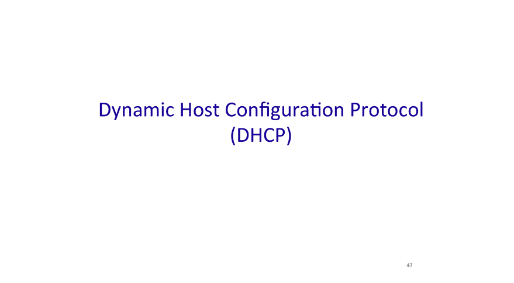

DHCP가 IP 주소, mask, router, DNS 등을 정해줌

---

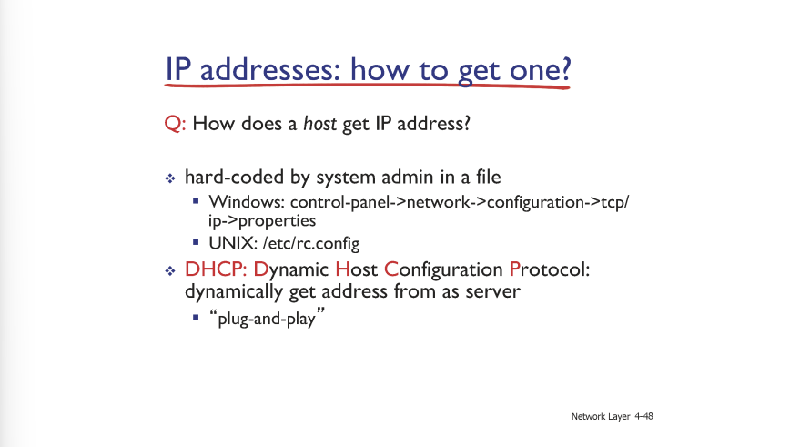

---

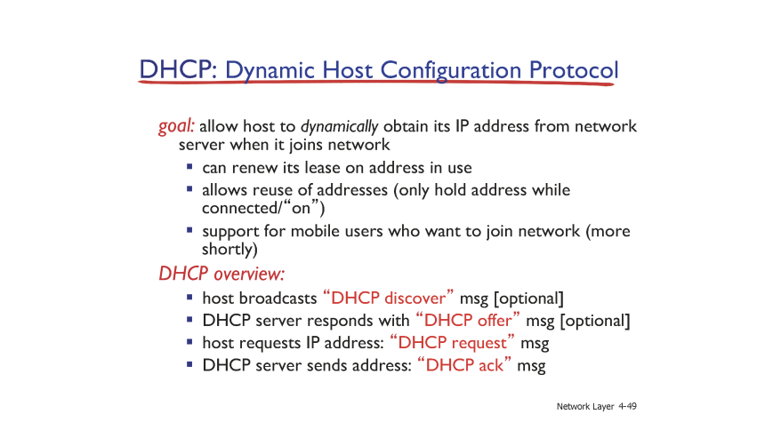

학생이 IP 주소 필요하다고 요청 오면 잠시 빌려주고 기간 끝나면 다시 회수

다시 달라하면 또주고

이게 DHCP

(고정 IC pool 을 통해)

---

---

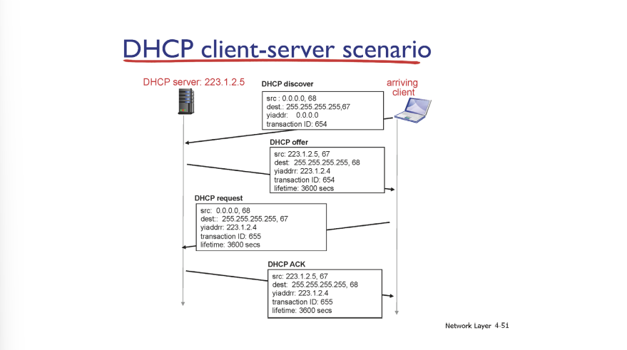

DHCP discover로 정보 달라고 함

68번에 client 돌리고 있겠다

dest 는 255.255.255.255.67 이다: subnet에 있는 놈들은 다 이 메세지 받아라

subnet 모든 호스트들이 메세지 다 받긴 하는데 DHCP 만 메세지를 의미있게 받아들이고 나머지 애들은 버려야함

어떤 원리로? 모든 애들이 받는건 확실한데 DHCP server가 돌고 있는 애만 67번 listenr 열고 듣고 있는 중 나머지 애들은 열지도 않고 layer 올라가다가 결국 터짐

DHCP offer destination은 broadcast 해당 client만 의미있게 받아드림

앞으로 223.1.2.4를 한시간 동안 쓸 수 있어! 라고 답 옴

client는 다시 맘에 든다고 request 보냄(아직 무명, IP 주소 쓴다고 확정한 건 아님)

transaction + 1 해서 보냄

ACK 오는 순간 해당 IP 주소 활용

request의 destination도 broadcast : 그냥 서버 주소 적으면 안됨?

DHCP 여러 개 중에 선택 안된 애들한테 간접적으로 알려주려고

보통은 gateway router에 DHCP server가 동작하고 있음

기본적으로 routing 함

NATs 프로토콜 돌고 있음

firewal(나중에 배움)

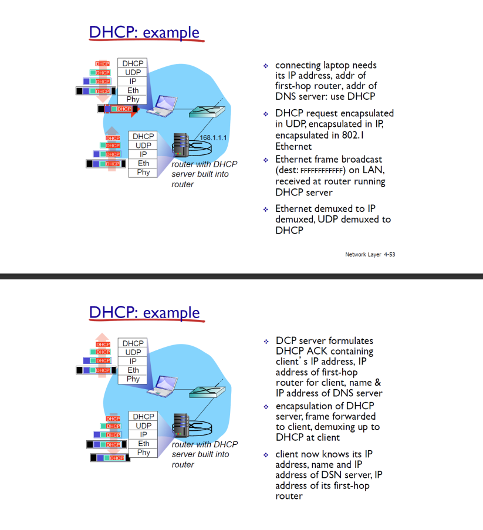

destination이 다 1이면 broadcast

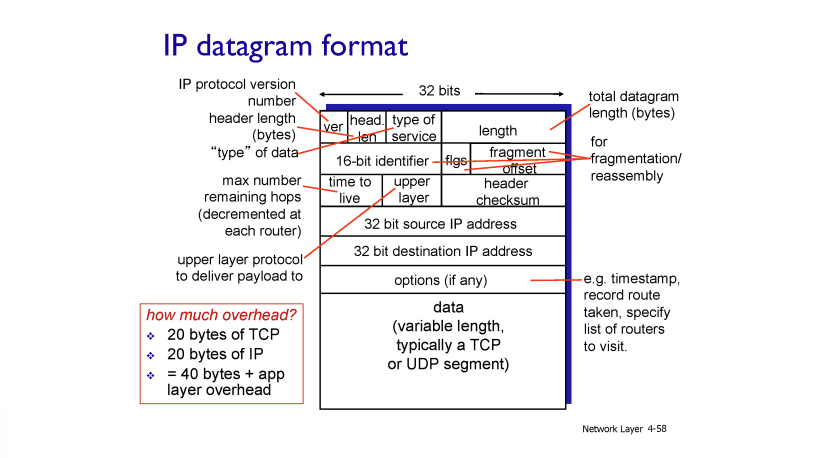

identifier

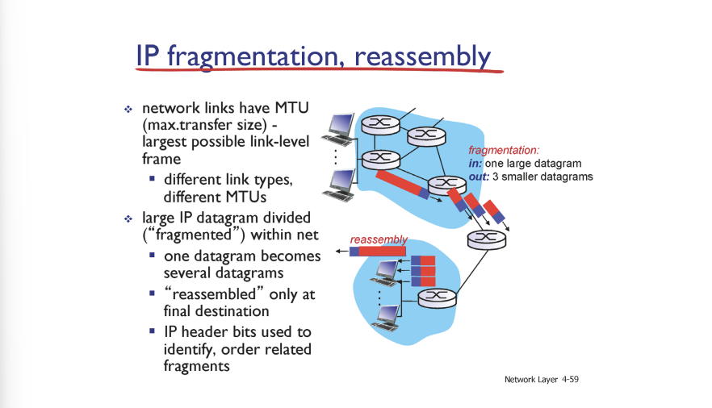

MTU는 각 인터넷 특성이 틀림

sender가 패킷 보냈는데 특정 링크 만났는데 해당 링크에서 MTU 한계보다 크면 분리함

MTU size에 맞는 fame으로 보냄( 서로 다른 패킷이 돼서 독립적으로 진행돼서 마지막에 합쳐짐)

이 작업을 위해 필요한게 identifier, flgs, fragment offset

flgs : fragment된게 있는지 없는지 0이후로는 없다는거

offset : 항상 /8 해서 적어줌, field 수 bit 줄이려고

중간에 하나 잃어버리면 재전송함

---

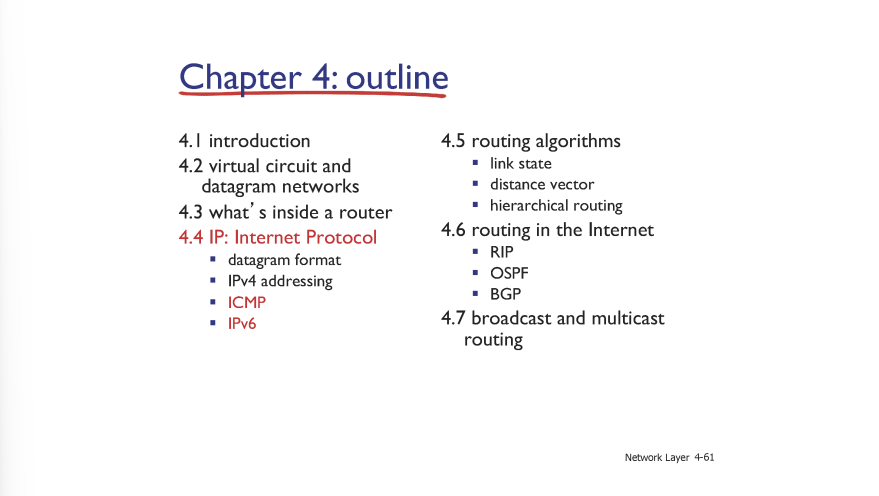

ICMP : control message 운반할 프로토콜이 필요해서 나옴

event message를 source한테 알려주려고

ipv4에 비해 header 단순

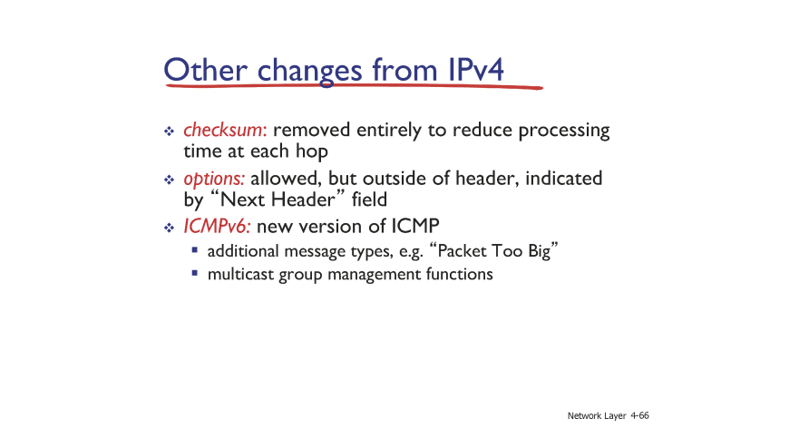

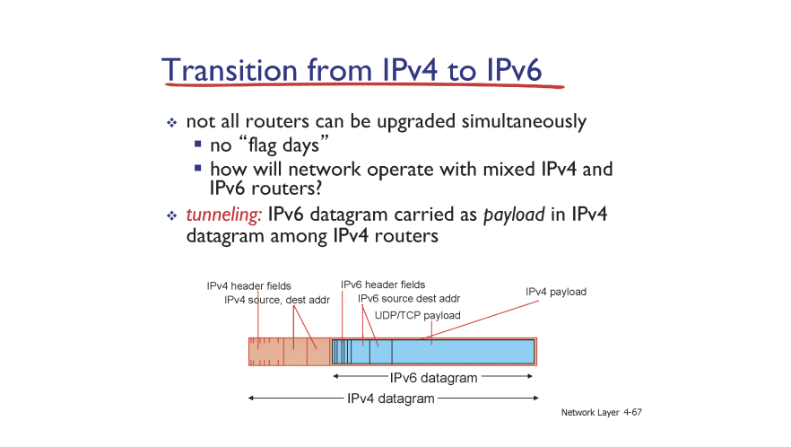

나중에 넘어가려할 때 (과도기 때) 새로운 동작과 기존 동작을 이해해서 tunneling 작업을 해주는 router가 필요함

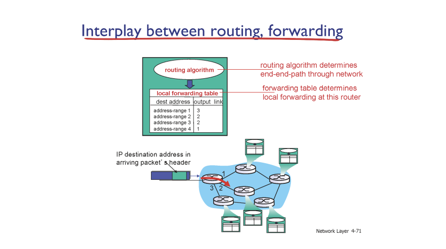

longest prefix matching

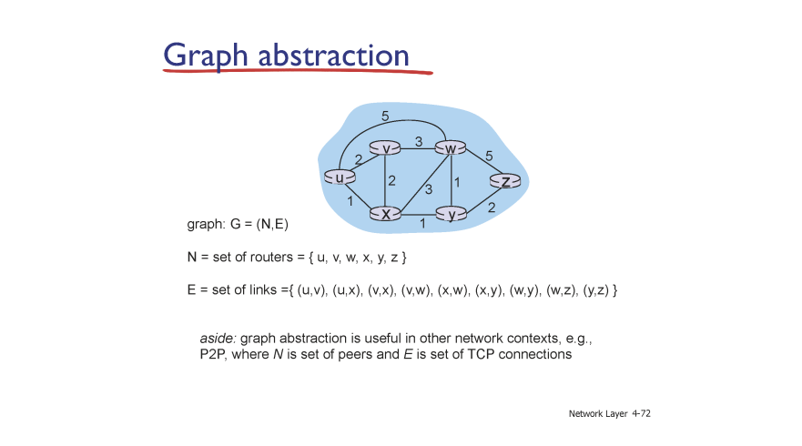

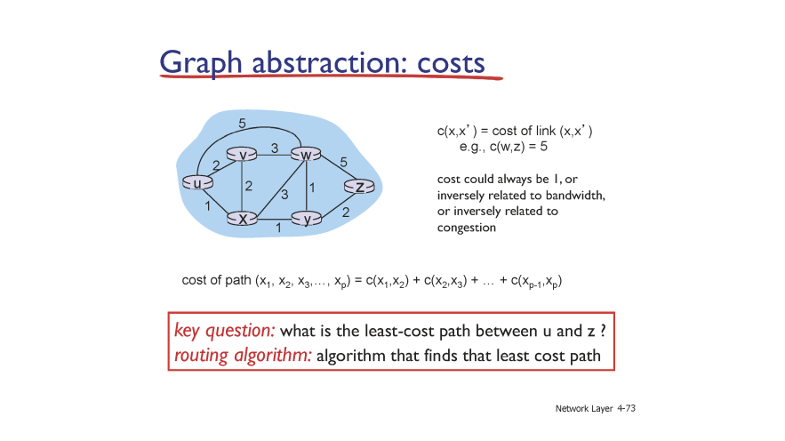

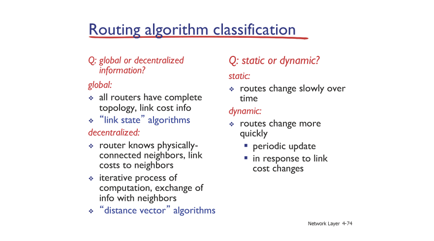

1. 모든 router가 목적지까지 모든 그래프를 다 아는경우
2. 내 이웃과만 정보 교환해서 최단 구하는 방법

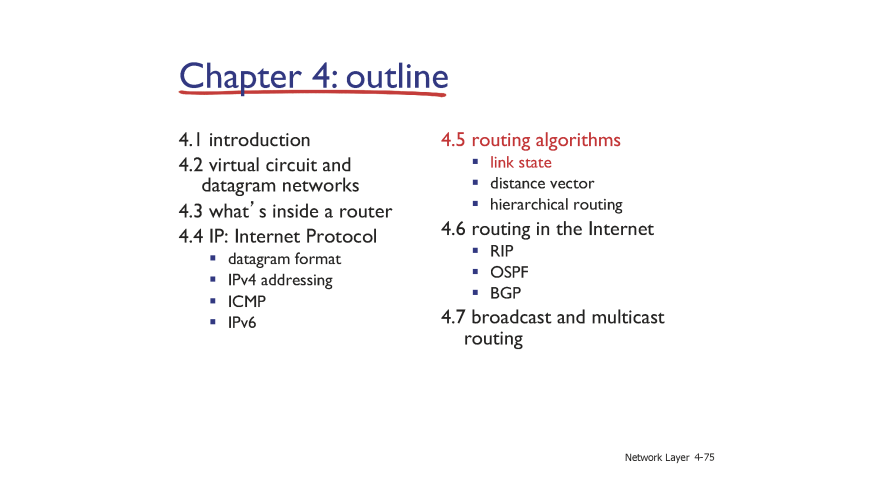

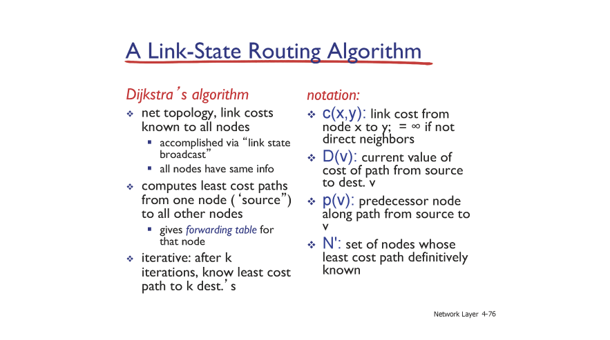

결국 forwarding table을 채우기 위한 것

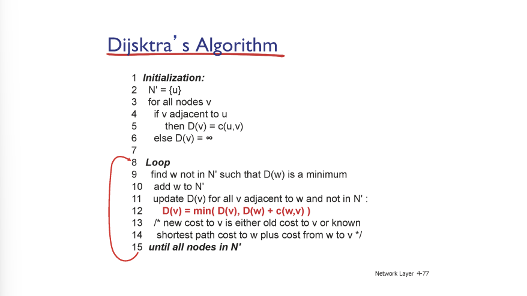

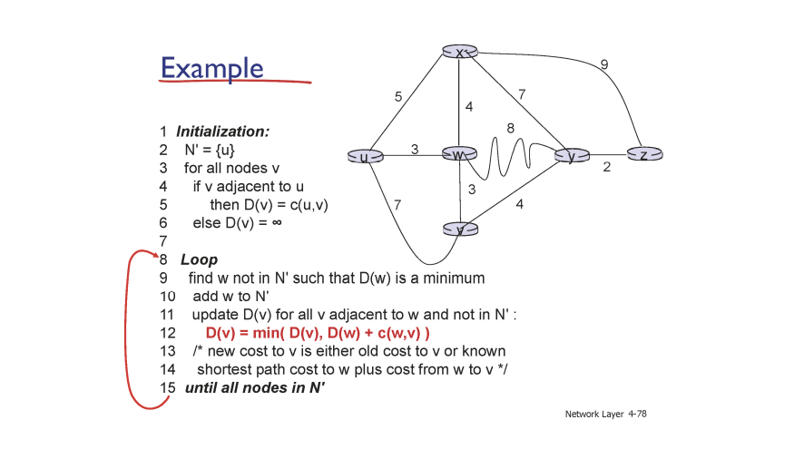

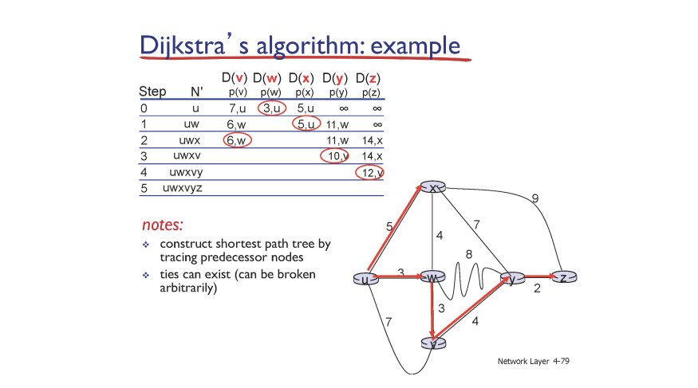

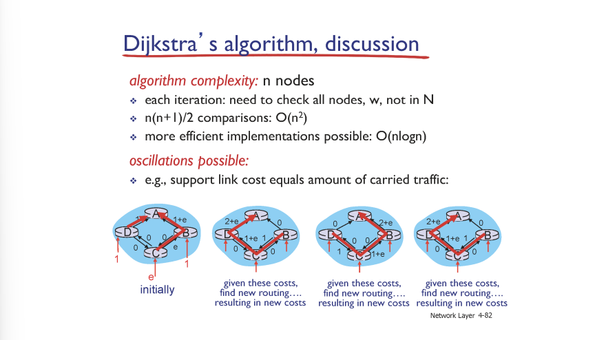

모든 노드 다 확인해야됨, 왔다갔다 해야됨

그럼 전세계 router 다 연결함? ㄴㄴ

한양대 ( 라우터 연결)	--- 성대 ( 라우터 연결) ---	SKT(라우터 연결)

관리 주체가 동일한 네트워크 연결

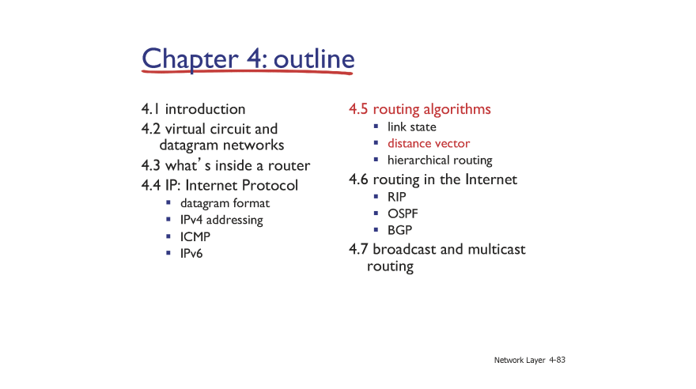

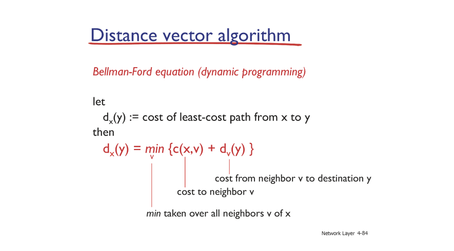