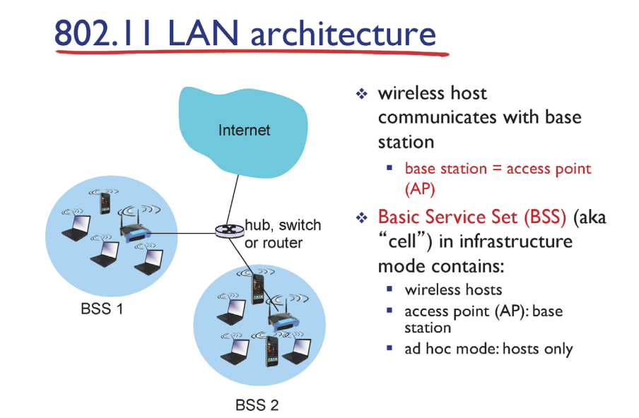
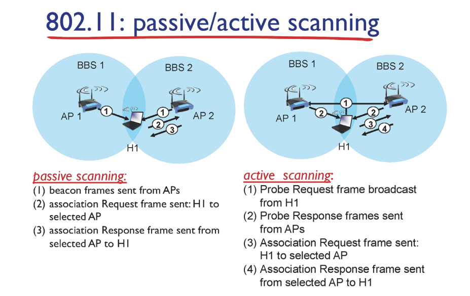
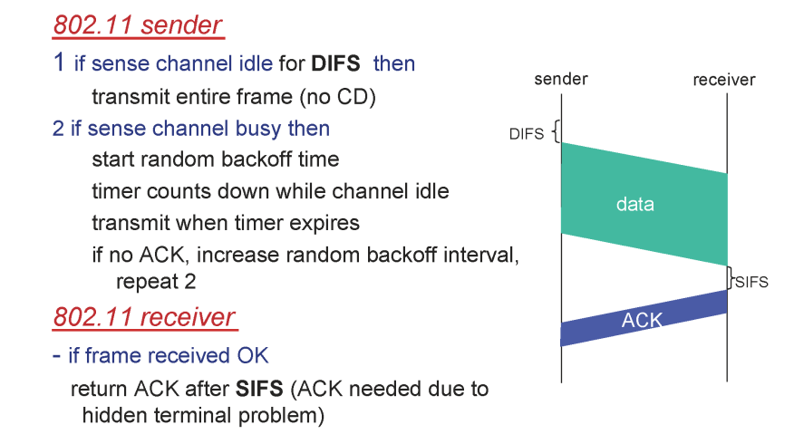
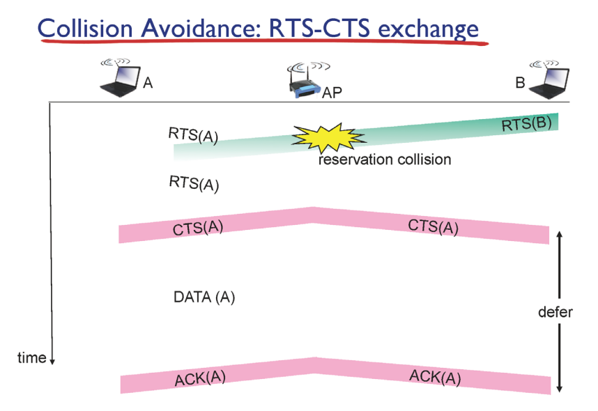
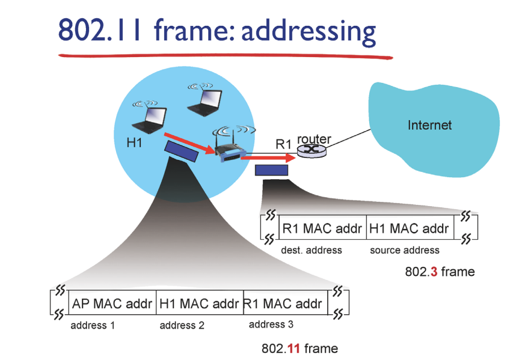
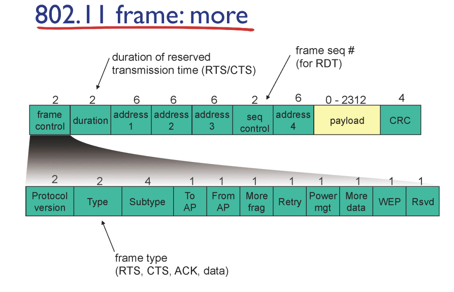
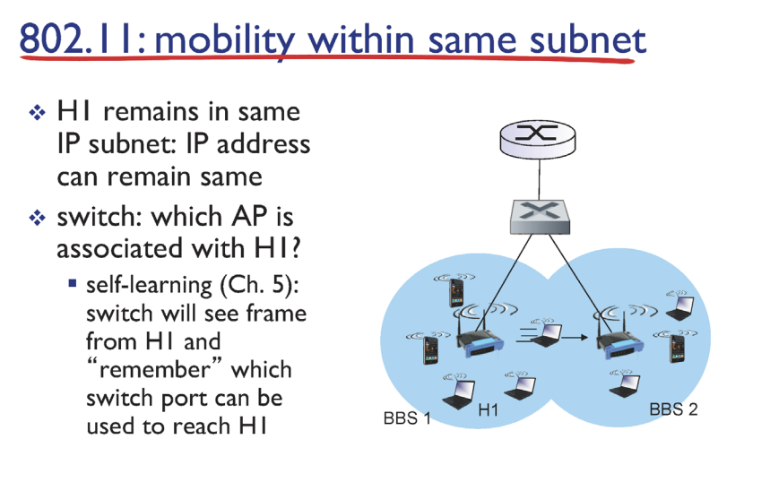
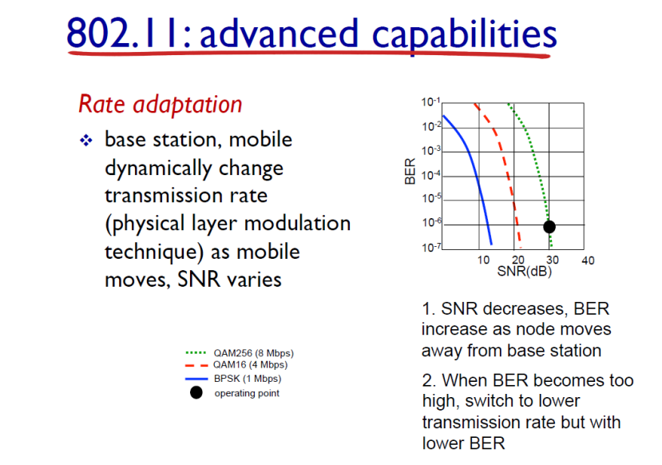

# IEEE 802.11 Wireless LAN(Wi - Fi)

## 802.11 LAN architecture

✔ BSS(Basic Service Set): 하나의 AP(Access Point)의 제어 하에 있는 WLAN의 구성 단위

## passive/active scanning

✔ **Passive Scanning**: 모든 AP들은 주기적으로 자신의 정보를 Beacon frame을 통해 broadcast한다.  
✔ active scanning: 잘 사용 안 한다.

## IEEE 802.11 Multiple Access

✔ 무선 링크의 특징 떄문에 충돌 감지가 어렵다 -> 유선 이더넷의 CSMA/CD를 사용하기 어렵다  
✔ **수신 여부를 확인하기 위한 ACK**를 사용한다 (TCP의 ACK(end to end)와는 다른 개념!!(hop to hop))

### CSMA/CA (Carrier-sense multiple access with collision avoidance)

1. DIFS 시간만큼 채널이 조용하면 데이터를 보낸다.
2. reciever는 데이터를 정상적으로 받았으면 SIFS만큼 대기한 후 ACK를 보낸다.

#### CSMA/CD와의 비교

✔ CSMA/CD: 충돌이 발생하면 일단 데이터 전송을 멈춘다  
✔ CSMA/CA: 충돌을 감지하는 기능이 없기 때문에 충돌이 발생하더라도 데이터가 끝까지 보내진다. -> **충돌의 리스크가 더 크다**

### CSMA/CA: RTS - CTS exchange

✔ 충돌의 리스크를 줄이기 위해 **데이터를 보내기 전에 확인 차원에서 작은 데이터를 보내는 방식**  
✔ RTS (ready to send): 데이터를 보내겠다는 의미의 작은 데이터 프레임을 AP에게 보낸다.  
✔ CTS (clear to send): 데이터를 받을 수 있다는 의미의 작은 데이터 프레임(AP 통신 범위 내에 broadcast)
✔ **CTS를 수신하면 해당 host는 데이터를 보내고 다른 host들은 대기한다**

## IEEE 802.11 Frame

### addressing

✔ 4개의 address field

1. address 1: 해당 frame을 수신하는 interface의 MAC address
2. address 2: 해당 frame을 전송하는 interface의 MAC address
3. address 3: 해당 frame을 처리하는 router의 MAC address
4. address 4: ad hoc 모드에서만 사용(잘 안 씀)

### 예시

✔ WLAN 내부에서 AP는 link layer device이다.  
✔ router 입장에서 AP는 하나의 스위치에 불과하다(AP를 인지 못하고 바로 H1으로 보낸다)  
✔ 왜 address field가 3개일까?

- **AP가 router(R1)에게 보내기 위한 mac address 필요!** (link layer device이기 때문에 IP로는 불가)

 
✔ 집에 있는 공유기는 AP랑 router가 합쳐진 작은 컴퓨터!

### more

## 802.11: Mobility Within Same Subnet

✔ 이동 과정에서 AP의 **연결을 유지** 시키는 것이 핵심!  
✔ 그런데 여기서 연결(connection)이란? -> **TCP**  
✔ **src ip/port & dest ip/port만 동일하게 유지되면 TCP 연결은 유지**된다!  
 
✔ **스위치에서 스위칭 테이블의 엔트리만 바꿔주면 AP가 변경된다!! -> Self Learning**

## 802.11: Advanced Capabilities

✔ 일반적으로 AP와 가까이 있을 수록 데이터 전송 성능과 효율(SNR)이 좋다  
✔ (채널환경)SNR이 좋을수록 높은 데이터 전송 레이트를 가진 전송방식(전송률은 높지만 소음에 취약하다)을 사용한다.

### Power Management

✔ 통신을 할 때 소모되는 전력이 그렇지 않을 때보다 10배 넘게 크다!!  
✔ 전력 소모를 위해 data를 보내지 않고 대기하고 있을 때 transmission/reception을 담당하는 회로는 잠든다.  